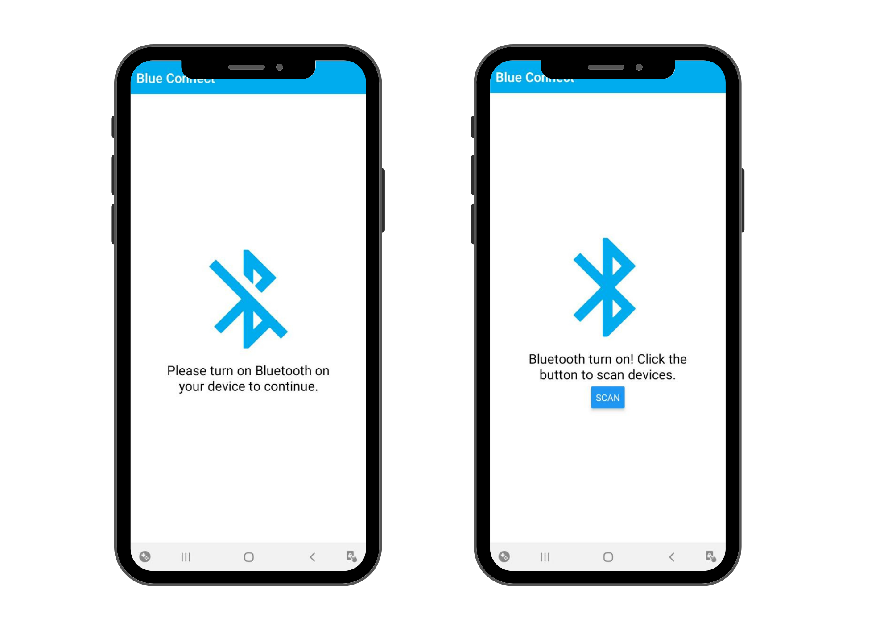

# Mobile App a React Native Bluetooth Low Energy library wrapping Multiplatform Ble Adapter (react-native-ble-plx)

## Configuration & Installation

### Expo

1. Make sure your Expo project is ejected (formerly: detached). You can read how to do it [here](https://docs.expo.io/versions/latest/expokit/eject/) and [here](https://docs.expo.io/versions/latest/expokit/expokit). (only for expo)
1. Follow steps for iOS/Android.

### Android ([example setup](https://github.com/Cierpliwy/SensorTag))

1. `npm install --save react-native-ble-plx`
1. In top level `build.gradle` make sure that min SDK version is at least 18:

    ```groovy
    buildscript {
        ext {
            ...
            minSdkVersion = 18
            ...
    ```
1. In `build.gradle` make sure to add jitpack repository to known repositories:

    ```groovy
    allprojects {
        repositories {
          ...
          maven { url 'https://www.jitpack.io' }
        }
    }
    ```
1. (Optional) In `AndroidManifest.xml`, add Bluetooth permissions and update `<uses-sdk/>`:

    ```xml
    <manifest xmlns:android="http://schemas.android.com/apk/res/android"
        ...
        <uses-permission android:name="android.permission.BLUETOOTH"/>
        <uses-permission android:name="android.permission.BLUETOOTH_ADMIN"/>
        <uses-permission-sdk-23 android:name="android.permission.ACCESS_FINE_LOCATION"/>

        <!-- Add this line if your application always requires BLE. More info can be found on:
            https://developer.android.com/guide/topics/connectivity/bluetooth-le.html#permissions
          -->
        <uses-feature android:name="android.hardware.bluetooth_le" android:required="true"/>

        ...
    ```

### Screenshot




## Author

- Website - [valentinacmp](https://github.com/valentinacmp)
- Frontend Mentor - [@valenmp](https://www.frontendmentor.io/profile/valenmp)
# test
